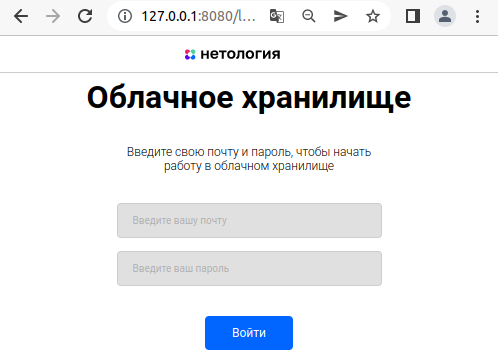

# Облачное хранилище файлов
Java11, Spring Boot, Spring Security, Spring Data JPA, Hibernate, JUnit, Mockito, TestContainers, Liquibase, Docker, Maven
## Описание
Данное приложение (REST - сервис) представляет REST интерфейс для загрузки, хранения, переименования и удаления файлов.
Все запросы к сервису проходят проверку авторизации и аутентификации пользователей. В качестве источника данных (пользователь, файл), а так интерфейса пользователя для отображения и взаимодействия (добавление, изменение, удаление), использовался [web проект](https://github.com/netology-code/jd-homeworks/tree/master/diploma/netology-diplom-frontend) разработанный на NodeJS.

## FRONT



## Подготовка
### Запуск web приложения (Front) для предоставления интерфейса взаимодействия с облачным хранилищем
1. Установить nodejs (версия не ниже 14.15.0) на компьютер следуя [инструкции](https://nodejs.org/ru/download/)
2. Скачать [FRONT](https://github.com/netology-code/jd-homeworks/blob/master/diploma/netology-diplom-frontend) (JavaScript)
3. Перейти в папку FRONT приложения и все команды для запуска выполнять из нее, предварительно установив Python.
4. Следуя описанию README.md FRONT проекта запустить nodejs приложение (npm install...)
5. Можно задать url для вызова своего backend сервиса:
   1. В файле .env FRONT (находится в корне проекта) приложения нужно изменить url до backend, например: VUE_APP_BASE_URL=http://localhost:8080
   2. Пересобрать и запустить FRONT снова: npm run build
   3. Измененный url сохранится для следующих запусков.
6. По-умолчанию FRONT запускается на порту 8080 и доступен по url в браузере http://localhost:8080
### Подключение базы данных 
Параметры подключения к БД установлены в [application.properties](src/main/resources) (по умолчанию MySQL)
Для формирования структуры таблиц, предварительное тестовое наполнение, контроль версий происходит с использованием [Liquibase](https://www.liquibase.org/)

#### Установка сервера БД
Вариант 1. Установка полноценного сервера БД
Вариант 2. Поднять docker контейнер с предустановленным сервером БД.
1. Установить Docker
2. Поднять docker контейнер с предустановленным сервером БД (например MySQL)
```
docker run --name mysql -e MYSQL_ROOT_PASSWORD=mysql -d -p 3306:3306 mysql:latest
```

## Запуск
Вариант 1. Формирование jar файла программы например с помощью Maven
```
mvn clean package
```
и запуск 
```
java -jar <путь/имя_файла>
```

Вариант 2.
Подготовленный docker-compose.yml, содержащий в себе контенер с базой данных и упакованным REST сервисом
```
docker-compose up
```

## Схема

